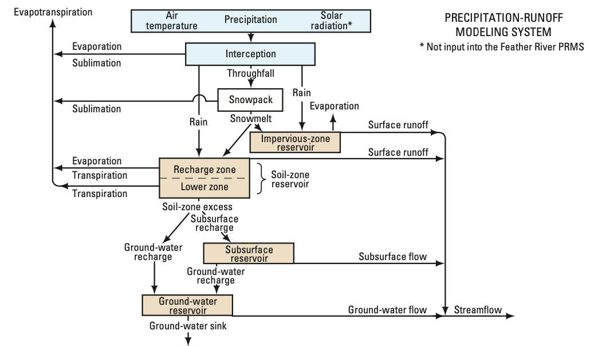

.. currentmodule:: pynhm

####################################################
pynhm: The USGS National Hydrologic Model in python
####################################################

.. toctree::
   :hidden:
   :caption: API Reference

    API Reference <api.rst>
    Preprocess <api/preprocess>
    Atmosphere <api/atmosphere>
    Base <api/base>
    Utils <api/utils>

.. toctree::
   :hidden:
   :caption: Index

    Index <genindex>
..
  Module Index <modindex>
